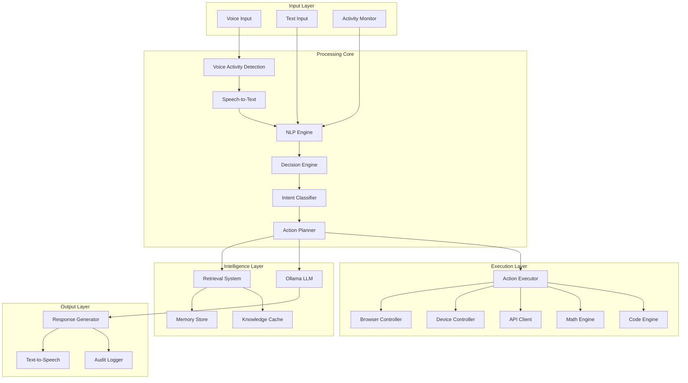

# Design Document: On-Device Assistant

## Overview

The On-Device Assistant is a CPU-optimized, privacy-first AI system built entirely in Python that surpasses commercial assistants through superior natural language understanding, ultra-fast response times, and comprehensive voice-controlled device management. The system architecture follows a modular pipeline design with asynchronous processing, enabling sub-second response times while running efficiently on CPU with minimal GPU usage.

### Design Principles

1. **CPU-First Architecture**: All components optimized for CPU execution using quantized models (int8), ONNX runtime, and efficient Python libraries
2. **Privacy by Default**: All data processing and storage occurs locally; no external transmission without explicit consent
3. **Speed Above All**: Target <800ms end-to-end latency through streaming, parallelization, and aggressive caching
4. **Modular Pipeline**: Independent components communicate via message queues for flexibility and scalability
5. **Python Ecosystem**: Leverage comprehensive Python libraries for maximum capability and rapid development

## Architecture

### High-Level System Architecture




### Component Communication

Components communicate via:
- **FastAPI WebSocket**: Real-time bidirectional communication for UI, browser extension, and CLI
- **asyncio Queues**: Internal message passing between pipeline stages
- **Redis (optional)**: High-performance caching layer for embeddings and API responses
- **SQLite**: Persistent storage for memory, audit logs, and configuration

### Performance Strategy

1. **Streaming Pipeline**: Start processing before input completes; stream partial results
2. **Parallel Execution**: Run independent actions concurrently using asyncio
3. **Aggressive Caching**: Cache embeddings, API responses, model outputs, and compiled code
4. **Model Quantization**: Use int8 quantized models via ONNX Runtime for 4x speedup
5. **Lazy Loading**: Load models and resources on-demand; unload when idle

## Components and Interfaces

### 1. Voice Input System

**Purpose**: Capture and transcribe voice input with ultra-low latency

**Components**:
- **Wakeword Detector**: Lightweight CNN model (Porcupine or custom) running continuously
- **VAD (Voice Activity Detection)**: WebRTC VAD or Silero VAD for speech segment detection
- **STT Engine**: Whisper-small quantized (int8) via ONNX Runtime or Vosk for offline recognition

**Python Libraries**:
- `pvporcupine`: Wakeword detection
- `webrtcvad` or `silero-vad`: Voice activity detection
- `faster-whisper`: Optimized Whisper inference
- `pyaudio` or `sounddevice`: Audio capture
- `onnxruntime`: Quantized model inference

**Interface**:
```python
class VoiceInputSystem:
    async def listen_for_wakeword(self) -> bool
    async def capture_audio_stream(self) -> AsyncIterator[bytes]
    async def transcribe_stream(self, audio: AsyncIterator[bytes]) -> AsyncIterator[str]
    async def get_final_transcript(self) -> str
```

**Performance Targets**:
- Wakeword detection: <200ms latency, <5% CPU usage
- VAD: <50ms latency
- STT: <300ms for 5-second utterance, streaming partial results every 100ms


### 2. NLP Engine

**Purpose**: Deep natural language understanding of real text with entity extraction, sentiment analysis, and semantic parsing

**Components**:
- **Text Preprocessor**: Normalization, language detection, tokenization
- **Entity Extractor**: Named entity recognition (NER) for people, places, dates, etc.
- **Sentiment Analyzer**: Emotion and sentiment classification
- **Semantic Parser**: Dependency parsing and semantic role labeling

**Python Libraries**:
- `spacy`: Core NLP pipeline with en_core_web_sm model
- `nltk`: Text processing utilities
- `transformers`: Hugging Face models for advanced NLP
- `langdetect`: Language detection
- `dateparser`: Natural date/time parsing

**Interface**:
```python
class NLPEngine:
    async def analyze(self, text: str) -> NLPResult
    async def extract_entities(self, text: str) -> List[Entity]
    async def detect_sentiment(self, text: str) -> Sentiment
    async def parse_semantics(self, text: str) -> SemanticGraph
```

**Data Models**:
```python
@dataclass
class NLPResult:
    text: str
    language: str
    entities: List[Entity]
    sentiment: Sentiment
    tokens: List[Token]
    dependencies: List[Dependency]
    
@dataclass
class Entity:
    text: str
    type: str  # PERSON, ORG, DATE, etc.
    start: int
    end: int
    confidence: float
```

**Performance Targets**:
- Analysis: <150ms for typical input (20-50 words)
- CPU-only execution with spaCy optimizations


### 3. Decision Engine and Intent Classification

**Purpose**: Classify user intent with 98% accuracy and make intelligent routing decisions

**Components**:
- **Intent Classifier**: Multi-class classifier (scikit-learn or small transformer)
- **Confidence Scorer**: Uncertainty estimation for ambiguous inputs
- **Context Manager**: Maintains conversation state and history

**Intent Categories**:
1. `COMMAND`: Device or browser control action
2. `QUESTION`: Information retrieval query
3. `MATH`: Mathematical calculation or operation
4. `CODE`: Coding task (write, debug, explain)
5. `FETCH`: API or web scraping request
6. `CONVERSATIONAL`: Casual chat or acknowledgment

**Python Libraries**:
- `scikit-learn`: Logistic regression or SVM classifier
- `transformers`: DistilBERT for complex classification
- `onnxruntime`: Quantized model inference
- `joblib`: Model serialization

**Interface**:
```python
class DecisionEngine:
    async def classify_intent(self, nlp_result: NLPResult) -> Intent
    async def get_confidence(self, intent: Intent) -> float
    async def should_clarify(self, intent: Intent) -> bool
    async def update_context(self, intent: Intent, response: str)

@dataclass
class Intent:
    category: str  # COMMAND, QUESTION, MATH, CODE, FETCH, CONVERSATIONAL
    confidence: float
    parameters: Dict[str, Any]
    context: Dict[str, Any]
```

**Training Data**:
- 10,000+ labeled examples per category
- Augmented with paraphrases and variations
- Continuously updated from user interactions (with consent)

**Performance Targets**:
- Classification: <100ms for 95% of inputs
- Accuracy: >98% on common intents


### 4. Action Planner

**Purpose**: Convert intents into executable action sequences with dependency management

**Components**:
- **Task Decomposer**: Breaks complex requests into atomic actions
- **Dependency Resolver**: Determines action ordering and parallelization
- **Resource Estimator**: Predicts execution time and cost
- **Fallback Generator**: Creates alternative plans for failures

**Action Types**:
- `RETRIEVE_MEMORY`: Search user memory store
- `RETRIEVE_KNOWLEDGE`: Search cached documents/websites
- `CALL_API`: Execute external API request
- `SCRAPE_WEB`: Fetch and parse website
- `COMPUTE_MATH`: Solve mathematical problem
- `EXECUTE_CODE`: Run code in sandbox
- `CONTROL_DEVICE`: Execute OS-level command
- `CONTROL_BROWSER`: Execute browser action
- `GENERATE_RESPONSE`: Create LLM response
- `SPEAK`: Synthesize and play audio

**Python Libraries**:
- `networkx`: Dependency graph management
- `asyncio`: Parallel execution

**Interface**:
```python
class ActionPlanner:
    async def plan(self, intent: Intent) -> ActionPlan
    async def optimize_plan(self, plan: ActionPlan) -> ActionPlan
    async def execute_plan(self, plan: ActionPlan) -> ExecutionResult

@dataclass
class ActionPlan:
    actions: List[Action]
    dependencies: Dict[str, List[str]]  # action_id -> [dependency_ids]
    estimated_time: float
    fallbacks: Dict[str, Action]

@dataclass
class Action:
    id: str
    type: str
    parameters: Dict[str, Any]
    estimated_time: float
    priority: int
```

**Optimization Strategy**:
1. Identify independent actions for parallel execution
2. Prefetch likely-needed resources
3. Cache intermediate results
4. Skip redundant actions

**Performance Targets**:
- Planning: <50ms for typical requests
- Execution: Parallel where possible, <500ms total for simple plans


### 5. Retrieval System

**Purpose**: Fast, accurate retrieval from memory, knowledge cache, and external sources

**Architecture**: Two-stage retrieval (sparse + dense)

**Stage 1 - Sparse Retrieval**:
- BM25 algorithm for keyword matching
- Fast initial filtering (top 100 candidates)
- Python library: `rank-bm25`

**Stage 2 - Dense Reranking**:
- Sentence embeddings for semantic similarity
- Rerank top 100 to final top 10
- Python library: `sentence-transformers` with `all-MiniLM-L6-v2` model

**Storage Backends**:
- **Vector DB**: Faiss (CPU) for dense embeddings
- **Document Store**: SQLite for metadata and text
- **Cache**: Redis or in-memory LRU for hot data

**Python Libraries**:
- `faiss-cpu`: Vector similarity search
- `sentence-transformers`: Embedding generation
- `rank-bm25`: Sparse retrieval
- `sqlite3`: Document storage
- `redis`: Optional caching layer

**Interface**:
```python
class RetrievalSystem:
    async def retrieve(self, query: str, sources: List[str], top_k: int = 10) -> List[Document]
    async def retrieve_memory(self, query: str) -> List[Document]
    async def retrieve_knowledge(self, query: str) -> List[Document]
    async def add_document(self, doc: Document)
    async def update_embeddings(self, doc_ids: List[str])

@dataclass
class Document:
    id: str
    text: str
    source: str  # memory, web, api, training
    metadata: Dict[str, Any]
    embedding: Optional[np.ndarray]
    timestamp: datetime
    confidence: float
```

**Indexing Strategy**:
- Precompute embeddings for all stored documents
- Incremental updates: only recompute changed documents
- Periodic full reindex (weekly)

**Performance Targets**:
- Retrieval: <400ms for 90% of queries
- Index update: <100ms per document


### 6. Memory Store

**Purpose**: Persistent storage of user preferences, history, and personalized facts

**Schema Design**:

```sql
-- User facts and preferences
CREATE TABLE user_facts (
    id TEXT PRIMARY KEY,
    category TEXT,  -- preference, fact, history
    key TEXT,
    value TEXT,
    confidence REAL,
    source TEXT,
    created_at TIMESTAMP,
    updated_at TIMESTAMP
);

-- Conversation history
CREATE TABLE conversations (
    id TEXT PRIMARY KEY,
    user_input TEXT,
    assistant_response TEXT,
    intent TEXT,
    actions TEXT,  -- JSON
    timestamp TIMESTAMP
);

-- Activity logs
CREATE TABLE activity_logs (
    id TEXT PRIMARY KEY,
    activity_type TEXT,  -- web, app
    details TEXT,  -- JSON
    timestamp TIMESTAMP
);

-- Embeddings index
CREATE TABLE embeddings (
    doc_id TEXT PRIMARY KEY,
    embedding BLOB,  -- numpy array serialized
    updated_at TIMESTAMP
);
```

**Python Libraries**:
- `sqlite3`: Database operations
- `sqlalchemy`: ORM (optional)
- `cryptography`: Encryption for sensitive data

**Interface**:
```python
class MemoryStore:
    async def store_fact(self, category: str, key: str, value: Any, confidence: float)
    async def retrieve_facts(self, query: str) -> List[Fact]
    async def store_conversation(self, user_input: str, response: str, intent: Intent)
    async def get_conversation_history(self, limit: int = 10) -> List[Conversation]
    async def store_activity(self, activity_type: str, details: Dict)
    async def get_recent_activity(self, activity_type: str, limit: int = 50) -> List[Activity]
```

**Privacy Features**:
- AES-256 encryption for sensitive fields
- User-controlled retention policies
- Bulk delete operations
- Export functionality


### 7. Ollama LLM Integration

**Purpose**: Local language model inference for response generation and reasoning

**Model Selection Strategy**:
- **Tiny tasks** (classification, extraction): Use specialized models or skip LLM
- **Simple responses**: Llama 3.2 1B quantized (int8)
- **Complex reasoning**: Llama 3.2 3B or Mistral 7B quantized (int4)
- **Code generation**: CodeLlama 7B quantized (int4)

**Python Libraries**:
- `ollama`: Official Python client
- `requests`: HTTP client for Ollama API

**Interface**:
```python
class OllamaClient:
    async def generate(self, prompt: str, model: str, max_tokens: int = 512) -> str
    async def generate_stream(self, prompt: str, model: str) -> AsyncIterator[str]
    async def embed(self, text: str) -> np.ndarray
    async def select_model(self, intent: Intent, complexity: str) -> str

@dataclass
class LLMConfig:
    model: str
    temperature: float = 0.7
    top_p: float = 0.9
    max_tokens: int = 512
    stop_sequences: List[str] = None
```

**Prompt Engineering**:
- System prompt includes: personality, constraints, available sources
- User prompt includes: query, retrieved context, conversation history
- Few-shot examples for consistent formatting

**Example Prompt Template**:
```
System: You are a helpful, friendly AI assistant. Be concise and accurate.
Context: {retrieved_documents}
History: {recent_conversations}
User: {user_query}
Assistant:
```

**Performance Optimization**:
- Model caching: Keep frequently-used models loaded
- Prompt caching: Cache common prompt prefixes
- Streaming: Start speaking before generation completes
- Early stopping: Stop generation when answer is complete

**Performance Targets**:
- First token: <400ms
- Generation speed: 20-30 tokens/second on CPU
- Total generation: <2 seconds for typical response


### 8. Action Executor

**Purpose**: Execute planned actions safely with proper sandboxing and error handling

**Executor Types**:

**8.1 Device Controller**

Controls OS-level operations via platform-specific APIs.

**Windows**:
- `pywin32`: COM automation, Windows API
- `comtypes`: Additional COM support
- PowerShell via `subprocess`

**Linux**:
- `dbus-python`: D-Bus communication
- `subprocess`: Shell commands
- `python-xlib`: X11 control

**macOS**:
- `pyobjc`: Objective-C bridge
- `subprocess`: AppleScript execution

**Interface**:
```python
class DeviceController:
    async def open_application(self, app_name: str) -> bool
    async def close_application(self, app_name: str) -> bool
    async def set_volume(self, level: int) -> bool
    async def take_screenshot(self, path: str) -> bool
    async def lock_screen() -> bool
    async def execute_command(self, command: str, safe: bool = True) -> CommandResult
```

**Safety Features**:
- Whitelist of allowed applications and commands
- Confirmation required for destructive operations
- Sandboxed execution with timeout limits
- Audit logging of all actions


**8.2 Browser Controller**

Controls browser via WebExtension and automation protocols.

**Architecture**:
- **WebExtension**: Injected into browser, listens on WebSocket
- **Automation Protocol**: Chrome DevTools Protocol or WebDriver

**Python Libraries**:
- `selenium`: WebDriver automation
- `pyppeteer`: Chrome DevTools Protocol
- `websockets`: Communication with extension

**Interface**:
```python
class BrowserController:
    async def navigate(self, url: str) -> bool
    async def open_tab(self, url: str) -> str  # returns tab_id
    async def close_tab(self, tab_id: str) -> bool
    async def click_element(self, selector: str) -> bool
    async def fill_form(self, field_id: str, value: str) -> bool
    async def scroll(self, direction: str, amount: int) -> bool
    async def get_page_content(self) -> str
    async def change_setting(self, setting: str, value: Any) -> bool
```

**WebExtension Manifest** (manifest.json):
```json
{
  "name": "Assistant Browser Controller",
  "version": "1.0",
  "permissions": ["tabs", "webNavigation", "storage", "activeTab"],
  "background": {
    "service_worker": "background.js"
  }
}
```

**Command Mapping Examples**:
- "open Gmail" → `navigate("https://gmail.com")`
- "close this tab" → `close_tab(active_tab_id)`
- "scroll down" → `scroll("down", 500)`
- "fill email field" → `fill_form("email", user_email)`


**8.3 API Client**

Executes authenticated API calls with caching and rate limiting.

**Python Libraries**:
- `requests`: HTTP client
- `aiohttp`: Async HTTP client
- `httpx`: Modern HTTP client with HTTP/2 support

**Interface**:
```python
class APIClient:
    async def call_api(self, endpoint: str, method: str, params: Dict, auth: Dict) -> APIResponse
    async def register_api(self, name: str, base_url: str, auth_config: Dict)
    async def get_cached_response(self, cache_key: str) -> Optional[APIResponse]
    async def set_rate_limit(self, api_name: str, requests_per_minute: int)

@dataclass
class APIResponse:
    status: int
    data: Any
    headers: Dict
    cached: bool
    timestamp: datetime
```

**Caching Strategy**:
- Cache GET requests by default
- TTL based on response headers (Cache-Control, Expires)
- Manual cache invalidation
- LRU eviction for memory management

**Supported APIs** (examples):
- Weather: OpenWeatherMap, WeatherAPI
- News: NewsAPI
- Search: DuckDuckGo, Brave Search
- Calendar: Google Calendar API
- Email: Gmail API
- Custom: User-configured endpoints


**8.4 Math Engine**

Solves mathematical problems using symbolic and numerical computation.

**Python Libraries**:
- `sympy`: Symbolic mathematics (algebra, calculus)
- `numpy`: Numerical arrays and operations
- `scipy`: Scientific computing (statistics, optimization)
- `mpmath`: Arbitrary-precision arithmetic

**Interface**:
```python
class MathEngine:
    async def evaluate(self, expression: str) -> MathResult
    async def solve_equation(self, equation: str, variable: str) -> List[Solution]
    async def differentiate(self, expression: str, variable: str) -> str
    async def integrate(self, expression: str, variable: str) -> str
    async def convert_units(self, value: float, from_unit: str, to_unit: str) -> float

@dataclass
class MathResult:
    result: Any  # number, expression, or list
    steps: List[str]  # step-by-step solution
    latex: str  # LaTeX representation
```

**Capabilities**:
- Arithmetic: Basic operations, order of operations
- Algebra: Equation solving, simplification, factoring
- Calculus: Derivatives, integrals, limits
- Statistics: Mean, median, std dev, distributions
- Linear Algebra: Matrix operations, eigenvalues
- Unit Conversion: Length, weight, temperature, currency

**Example Inputs**:
- "2 + 2 * 3" → 8
- "solve x^2 - 5x + 6 = 0" → [2, 3]
- "derivative of x^2 + 3x" → "2*x + 3"
- "convert 100 fahrenheit to celsius" → 37.78


**8.5 Code Engine**

Executes, debugs, and explains code in multiple languages.

**Python Libraries**:
- `ast`: Python AST parsing
- `pylint`: Static code analysis
- `black`: Code formatting
- `subprocess`: Execute code in isolated processes
- `docker`: Sandboxed execution (optional)

**Interface**:
```python
class CodeEngine:
    async def execute_python(self, code: str, timeout: int = 5) -> ExecutionResult
    async def analyze_code(self, code: str, language: str) -> CodeAnalysis
    async def format_code(self, code: str, language: str) -> str
    async def explain_code(self, code: str, language: str) -> str
    async def debug_code(self, code: str, error: str) -> DebugSuggestion

@dataclass
class ExecutionResult:
    stdout: str
    stderr: str
    return_code: int
    execution_time: float

@dataclass
class CodeAnalysis:
    errors: List[str]
    warnings: List[str]
    suggestions: List[str]
    complexity: int
```

**Sandboxing Strategy**:
- Restricted imports (no os, subprocess, etc.)
- Memory limits (100MB)
- CPU time limits (5 seconds)
- No file system access
- No network access

**Supported Languages**:
- **Full execution**: Python
- **Analysis only**: JavaScript, Java, C++, Go, Rust
- **Explanation**: All major languages via LLM


### 9. Text-to-Speech System

**Purpose**: High-quality, natural voice synthesis with low latency

**Architecture Options**:

**Option A: Neural TTS (Higher Quality)**
- Model: Coqui TTS or VITS
- Vocoder: HiFi-GAN or MB-MelGAN (quantized)
- Latency: 300-400ms first audio
- Quality: Near-human

**Option B: Parametric TTS (Lower Latency)**
- Model: FastSpeech2
- Vocoder: Griffin-Lim or lightweight neural
- Latency: 200-300ms first audio
- Quality: Good

**Python Libraries**:
- `TTS` (Coqui): Neural TTS models
- `pyttsx3`: Fallback system TTS
- `sounddevice`: Audio playback
- `onnxruntime`: Quantized model inference

**Interface**:
```python
class TTSSystem:
    async def synthesize(self, text: str, voice: str = "default") -> bytes
    async def synthesize_stream(self, text: str, voice: str = "default") -> AsyncIterator[bytes]
    async def set_voice(self, voice_id: str)
    async def set_speed(self, speed: float)  # 0.5 to 2.0
    async def set_pitch(self, pitch: float)  # 0.5 to 2.0
    async def list_voices(self) -> List[Voice]

@dataclass
class Voice:
    id: str
    name: str
    language: str
    gender: str
    sample_rate: int
```

**Voice Personas**:
- Default: Neutral, professional
- Friendly: Warm, conversational
- Formal: Clear, authoritative
- Custom: User-trained voices (optional)

**Optimization**:
- Precompute phoneme sequences for common phrases
- Stream audio chunks (start playing before synthesis completes)
- Cache synthesized audio for repeated phrases
- Use int8 quantized models

**Performance Targets**:
- First audio chunk: <300ms
- Real-time factor: <0.5 (generate 1 second of audio in 0.5 seconds)


### 10. Activity Monitor

**Purpose**: Observe user web and app activity for contextual assistance

**Components**:

**10.1 Web Activity Monitor**
- Browser extension tracks: URLs, page titles, time spent, scroll depth
- Privacy: Only with explicit consent, configurable domains
- Storage: Local SQLite database

**10.2 App Activity Monitor**
- OS-specific APIs track: active window, app name, usage duration
- Privacy: Whitelist/blacklist of monitored apps
- Storage: Local SQLite database

**Python Libraries**:
- `psutil`: Process and system monitoring
- `pygetwindow`: Window management (Windows)
- `AppKit`: macOS app monitoring
- `Xlib`: Linux window monitoring

**Interface**:
```python
class ActivityMonitor:
    async def start_monitoring(self, types: List[str])  # ['web', 'app']
    async def stop_monitoring(self)
    async def get_current_activity(self) -> Activity
    async def get_activity_summary(self, hours: int = 24) -> ActivitySummary
    async def is_monitoring_enabled(self, activity_type: str) -> bool

@dataclass
class Activity:
    type: str  # web or app
    name: str  # URL or app name
    title: str
    start_time: datetime
    duration: float  # seconds

@dataclass
class ActivitySummary:
    total_time: float
    top_websites: List[Tuple[str, float]]
    top_apps: List[Tuple[str, float]]
    patterns: Dict[str, Any]
```

**Privacy Controls**:
- Opt-in only, disabled by default
- Domain/app blacklist (never monitor)
- Incognito/private mode detection (skip monitoring)
- Data retention limits (default: 30 days)
- One-click delete all activity data

**Use Cases**:
- "What was that website I visited yesterday about Python?"
- "How much time did I spend on email today?"
- "Remind me about this page later"
- Context-aware suggestions based on current activity


### 11. Response Generator

**Purpose**: Create friendly, context-aware responses with source attribution

**Components**:
- **Template Engine**: Pre-defined response templates for common queries
- **LLM Generator**: Dynamic generation for complex responses
- **Source Attributor**: Adds provenance metadata
- **Personality Layer**: Applies conversational tone and style

**Python Libraries**:
- `jinja2`: Template rendering
- `textwrap`: Text formatting

**Interface**:
```python
class ResponseGenerator:
    async def generate(self, intent: Intent, context: Context, sources: List[Document]) -> Response
    async def apply_personality(self, text: str, style: str = "friendly") -> str
    async def add_suggestions(self, response: Response, intent: Intent) -> Response

@dataclass
class Response:
    text: str
    sources: List[Document]
    confidence: float
    suggestions: List[str]
    metadata: Dict[str, Any]
```

**Response Styles**:
- **Friendly** (default): Warm, conversational, uses contractions
- **Formal**: Professional, complete sentences, no slang
- **Concise**: Brief, direct answers
- **Detailed**: Comprehensive explanations with examples

**Template Examples**:
```python
TEMPLATES = {
    "weather": "The weather in {location} is {condition} with a temperature of {temp}°F.",
    "time": "It's currently {time}.",
    "calculation": "The answer is {result}.",
    "error": "I'm sorry, I couldn't {action} because {reason}. Would you like me to try something else?"
}
```

**Personality Traits**:
- Helpful and proactive
- Admits uncertainty ("I'm not sure, but...")
- Offers alternatives when primary action fails
- Uses natural language, not robotic
- Appropriate humor (subtle, not forced)


### 12. Consent Manager

**Purpose**: Enforce granular permissions and user privacy preferences

**Permission Types**:
- `MONITOR_WEB`: Track web browsing activity
- `MONITOR_APPS`: Track application usage
- `CONTROL_DEVICE`: Execute OS-level commands
- `CONTROL_BROWSER`: Control browser actions
- `ACCESS_MEMORY`: Read conversation history and user facts
- `CALL_APIS`: Make external API requests
- `UPLOAD_DATA`: Send data outside the device

**Python Libraries**:
- `sqlite3`: Permission storage
- `cryptography`: Secure token generation

**Interface**:
```python
class ConsentManager:
    async def request_permission(self, permission: str, reason: str) -> bool
    async def check_permission(self, permission: str) -> bool
    async def revoke_permission(self, permission: str)
    async def get_all_permissions(self) -> Dict[str, bool]
    async def require_confirmation(self, action: str, risk_level: str) -> bool

@dataclass
class Permission:
    name: str
    granted: bool
    granted_at: Optional[datetime]
    expires_at: Optional[datetime]
    scope: str  # all, specific_domains, specific_apps
```

**Risk Levels**:
- **LOW**: Read-only operations, information retrieval
- **MEDIUM**: Browser navigation, app opening
- **HIGH**: File operations, system settings changes
- **CRITICAL**: Data deletion, system shutdown, external uploads

**Confirmation Flow**:
1. Action requested
2. Risk level assessed
3. If HIGH or CRITICAL: Prompt user for confirmation
4. Log decision
5. Execute or deny

**Default Permissions**:
- All permissions denied by default
- First-run wizard guides user through permission setup
- Granular controls in settings UI


### 13. Local Server and API

**Purpose**: Provide REST and WebSocket APIs for UI, extensions, and integrations

**Framework**: FastAPI with WebSocket support

**Python Libraries**:
- `fastapi`: Web framework
- `uvicorn`: ASGI server
- `websockets`: WebSocket support
- `pydantic`: Request/response validation

**API Endpoints**:

**REST API**:
```
POST   /api/v1/query              # Submit text query
POST   /api/v1/voice              # Submit voice audio
GET    /api/v1/status             # System status
GET    /api/v1/memory             # Retrieve memory
POST   /api/v1/memory             # Store memory
GET    /api/v1/permissions        # List permissions
POST   /api/v1/permissions        # Grant permission
DELETE /api/v1/permissions/{id}   # Revoke permission
GET    /api/v1/activity           # Get activity logs
DELETE /api/v1/activity           # Clear activity
GET    /api/v1/config             # Get configuration
PUT    /api/v1/config             # Update configuration
```

**WebSocket API**:
```
/ws/assistant    # Bidirectional real-time communication
```

**WebSocket Message Format**:
```json
{
  "type": "query|response|status|error",
  "id": "unique-message-id",
  "data": {
    "text": "user input or assistant response",
    "intent": "COMMAND|QUESTION|...",
    "sources": [...],
    "confidence": 0.95
  },
  "timestamp": "2024-10-24T12:00:00Z"
}
```

**Interface**:
```python
class LocalServer:
    async def start(self, host: str = "127.0.0.1", port: int = 8000)
    async def stop(self)
    async def handle_query(self, request: QueryRequest) -> QueryResponse
    async def handle_websocket(self, websocket: WebSocket)

@dataclass
class QueryRequest:
    text: str
    context: Optional[Dict] = None
    stream: bool = False

@dataclass
class QueryResponse:
    text: str
    intent: str
    sources: List[Document]
    confidence: float
    execution_time: float
```

**Security**:
- Bind to localhost only (127.0.0.1)
- API key authentication (optional)
- CORS restricted to localhost origins
- Rate limiting per client


## Data Models

### Core Data Structures

```python
from dataclasses import dataclass
from typing import List, Dict, Any, Optional
from datetime import datetime
import numpy as np

@dataclass
class UserInput:
    """Raw user input from any source"""
    text: str
    source: str  # voice, text, api
    timestamp: datetime
    metadata: Dict[str, Any]

@dataclass
class NLPResult:
    """Output from NLP analysis"""
    text: str
    language: str
    entities: List[Entity]
    sentiment: Sentiment
    tokens: List[Token]
    dependencies: List[Dependency]

@dataclass
class Entity:
    """Named entity"""
    text: str
    type: str  # PERSON, ORG, DATE, GPE, etc.
    start: int
    end: int
    confidence: float

@dataclass
class Sentiment:
    """Sentiment analysis result"""
    polarity: float  # -1 to 1
    subjectivity: float  # 0 to 1
    label: str  # positive, negative, neutral

@dataclass
class Intent:
    """Classified user intent"""
    category: str  # COMMAND, QUESTION, MATH, CODE, FETCH, CONVERSATIONAL
    confidence: float
    parameters: Dict[str, Any]
    context: Dict[str, Any]

@dataclass
class Action:
    """Single executable action"""
    id: str
    type: str
    parameters: Dict[str, Any]
    estimated_time: float
    priority: int
    status: str  # pending, running, completed, failed

@dataclass
class ActionPlan:
    """Complete execution plan"""
    actions: List[Action]
    dependencies: Dict[str, List[str]]
    estimated_time: float
    fallbacks: Dict[str, Action]

@dataclass
class Document:
    """Retrieved document with metadata"""
    id: str
    text: str
    source: str  # memory, web, api, training
    metadata: Dict[str, Any]
    embedding: Optional[np.ndarray]
    timestamp: datetime
    confidence: float

@dataclass
class Response:
    """Final assistant response"""
    text: str
    sources: List[Document]
    confidence: float
    suggestions: List[str]
    metadata: Dict[str, Any]
    execution_time: float

@dataclass
class Conversation:
    """Conversation turn"""
    id: str
    user_input: str
    assistant_response: str
    intent: Intent
    actions: List[Action]
    timestamp: datetime
```


## Error Handling

### Error Categories

1. **Input Errors**: Invalid or ambiguous user input
2. **Processing Errors**: NLP, classification, or planning failures
3. **Execution Errors**: Action execution failures
4. **Resource Errors**: Memory, CPU, or network issues
5. **Permission Errors**: Unauthorized action attempts

### Error Handling Strategy

```python
class AssistantError(Exception):
    """Base exception for all assistant errors"""
    def __init__(self, message: str, category: str, recoverable: bool = True):
        self.message = message
        self.category = category
        self.recoverable = recoverable
        super().__init__(message)

class InputError(AssistantError):
    """User input cannot be processed"""
    pass

class ExecutionError(AssistantError):
    """Action execution failed"""
    pass

class PermissionError(AssistantError):
    """Permission denied"""
    pass
```

### Error Recovery

**Retry Strategy**:
- Transient errors: Retry up to 3 times with exponential backoff
- Permanent errors: Fail immediately, suggest alternatives

**Fallback Actions**:
- Primary action fails → Try fallback action
- All actions fail → Inform user, suggest manual approach
- Critical failure → Safe mode (read-only operations)

**User Communication**:
- Clear error messages in natural language
- Suggest corrective actions
- Offer to try alternative approaches
- Never expose technical stack traces to user

**Example Error Responses**:
```python
ERROR_TEMPLATES = {
    "api_timeout": "I couldn't reach {service} right now. Would you like me to try again or use cached data?",
    "permission_denied": "I need permission to {action}. Would you like to grant it in settings?",
    "ambiguous_input": "I'm not sure if you want me to {option1} or {option2}. Which one?",
    "execution_failed": "I tried to {action} but encountered an error. Let me try a different approach."
}
```

### Logging

**Log Levels**:
- DEBUG: Detailed execution traces
- INFO: Normal operations, user queries
- WARNING: Recoverable errors, fallbacks used
- ERROR: Failed operations, unrecoverable errors
- CRITICAL: System failures

**Log Storage**:
- Rolling file logs (max 100MB, 7 days retention)
- Structured JSON format for parsing
- Sensitive data redacted (passwords, tokens)


## Testing Strategy

### Unit Tests

**Coverage Target**: 80% code coverage

**Test Framework**: pytest

**Key Test Areas**:
- NLP Engine: Entity extraction, sentiment analysis
- Intent Classifier: Classification accuracy on test set
- Action Planner: Dependency resolution, optimization
- Retrieval System: Ranking quality, speed
- Math Engine: Calculation correctness
- Code Engine: Sandboxing, execution safety

**Example Test**:
```python
import pytest
from assistant.nlp import NLPEngine

@pytest.mark.asyncio
async def test_entity_extraction():
    nlp = NLPEngine()
    result = await nlp.analyze("Meet me in New York on Friday")
    
    assert len(result.entities) == 2
    assert result.entities[0].type == "GPE"
    assert result.entities[0].text == "New York"
    assert result.entities[1].type == "DATE"
    assert result.entities[1].text == "Friday"
```

### Integration Tests

**Test Scenarios**:
- End-to-end query processing
- Voice input → text output pipeline
- Multi-action plan execution
- Error recovery and fallbacks
- Permission enforcement

**Test Environment**:
- Mock external APIs
- Isolated test database
- Simulated user interactions

### Performance Tests

**Metrics**:
- Latency: p50, p95, p99 for each component
- Throughput: Queries per second
- Resource usage: CPU, memory, disk I/O

**Benchmarks**:
- Simple query: <800ms end-to-end
- Complex query: <2000ms end-to-end
- Voice transcription: <300ms for 5-second audio
- TTS synthesis: <300ms first audio

**Tools**:
- `pytest-benchmark`: Performance testing
- `memory_profiler`: Memory usage analysis
- `cProfile`: CPU profiling

### Safety Tests

**Security Checks**:
- Command injection prevention
- Path traversal prevention
- Privilege escalation prevention
- Data leakage prevention

**Privacy Checks**:
- Data encryption verification
- Permission enforcement
- Audit log completeness


## Performance Optimization

### CPU Optimization Strategies

**1. Model Quantization**
- Convert all models to int8 using ONNX Runtime
- Use quantization-aware training where possible
- Target: 4x speedup with <2% accuracy loss

**2. Caching**
- **Embedding Cache**: Precomputed embeddings for all stored documents
- **Model Cache**: Keep frequently-used models in memory
- **Response Cache**: Cache responses for repeated queries
- **Computation Cache**: Memoize expensive operations

**3. Asynchronous Processing**
```python
async def process_query(query: str) -> Response:
    # Start multiple operations in parallel
    nlp_task = asyncio.create_task(nlp_engine.analyze(query))
    retrieval_task = asyncio.create_task(retrieval_system.retrieve(query))
    
    # Wait for both to complete
    nlp_result, documents = await asyncio.gather(nlp_task, retrieval_task)
    
    # Continue processing...
```

**4. Streaming**
- Stream STT output as it's generated
- Stream LLM tokens as they're produced
- Stream TTS audio as it's synthesized
- Start next stage before previous completes

**5. Lazy Loading**
- Load models on first use
- Unload unused models after 5 minutes idle
- Prioritize frequently-used models

**6. Batch Processing**
- Batch embedding generation
- Batch API requests where possible
- Batch database operations

### Memory Optimization

**1. Model Sharing**
- Share embedding models across components
- Use memory-mapped files for large models
- Implement model pooling

**2. Data Structures**
- Use numpy arrays instead of Python lists
- Use generators for large datasets
- Implement pagination for database queries

**3. Garbage Collection**
- Explicit cleanup of large objects
- Periodic garbage collection
- Memory profiling in production

### Disk I/O Optimization

**1. Database Optimization**
- Index frequently-queried columns
- Use prepared statements
- Batch inserts and updates
- Enable WAL mode for SQLite

**2. File Caching**
- Cache frequently-accessed files in memory
- Use memory-mapped files for large datasets
- Implement LRU eviction


## Deployment Architecture

### System Requirements

**Minimum**:
- CPU: 4 cores, 2.0 GHz
- RAM: 8 GB
- Disk: 10 GB free space
- OS: Windows 10+, macOS 11+, Ubuntu 20.04+

**Recommended**:
- CPU: 8 cores, 3.0 GHz
- RAM: 16 GB
- Disk: 20 GB SSD
- OS: Latest stable versions

### Installation

**1. Python Environment**
```bash
# Create virtual environment
python -m venv venv
source venv/bin/activate  # or venv\Scripts\activate on Windows

# Install dependencies
pip install -r requirements.txt
```

**2. Ollama Setup**
```bash
# Install Ollama
curl https://ollama.ai/install.sh | sh

# Pull required models
ollama pull llama3.2:1b-instruct-q8_0
ollama pull llama3.2:3b-instruct-q4_0
```

**3. Model Downloads**
```bash
# Download NLP models
python -m spacy download en_core_web_sm

# Download STT model
python scripts/download_models.py --stt whisper-small

# Download TTS model
python scripts/download_models.py --tts coqui-tts
```

**4. Database Initialization**
```bash
# Initialize SQLite databases
python scripts/init_db.py

# Create vector indices
python scripts/init_vector_db.py
```

### Directory Structure

```
assistant/
├── core/
│   ├── nlp.py              # NLP Engine
│   ├── decision.py         # Decision Engine
│   ├── planner.py          # Action Planner
│   └── retrieval.py        # Retrieval System
├── voice/
│   ├── stt.py              # Speech-to-Text
│   ├── tts.py              # Text-to-Speech
│   └── wakeword.py         # Wakeword Detection
├── execution/
│   ├── device.py           # Device Controller
│   ├── browser.py          # Browser Controller
│   ├── api_client.py       # API Client
│   ├── math_engine.py      # Math Engine
│   └── code_engine.py      # Code Engine
├── storage/
│   ├── memory.py           # Memory Store
│   ├── cache.py            # Knowledge Cache
│   └── vector_db.py        # Vector Database
├── server/
│   ├── api.py              # FastAPI Server
│   └── websocket.py        # WebSocket Handler
├── monitoring/
│   ├── activity.py         # Activity Monitor
│   ├── consent.py          # Consent Manager
│   └── logger.py           # Audit Logger
├── models/                 # Downloaded models
├── data/                   # Databases and cache
├── config/                 # Configuration files
└── tests/                  # Test suite
```


### Configuration Management

**config/default.yaml**:
```yaml
# Core settings
assistant:
  name: "Assistant"
  personality: "friendly"
  language: "en"

# Model settings
models:
  llm:
    default: "llama3.2:1b-instruct-q8_0"
    complex: "llama3.2:3b-instruct-q4_0"
    code: "codellama:7b-instruct-q4_0"
  stt:
    model: "whisper-small"
    language: "en"
  tts:
    model: "coqui-tts"
    voice: "default"
    speed: 1.0

# Performance settings
performance:
  max_concurrent_actions: 5
  model_cache_size: 3
  response_cache_ttl: 3600
  embedding_batch_size: 32

# Privacy settings
privacy:
  data_retention_days: 30
  encrypt_memory: true
  default_permissions:
    monitor_web: false
    monitor_apps: false
    control_device: false
    control_browser: false

# Server settings
server:
  host: "127.0.0.1"
  port: 8000
  cors_origins: ["http://localhost:*"]

# Logging settings
logging:
  level: "INFO"
  file: "data/logs/assistant.log"
  max_size_mb: 100
  retention_days: 7
```

### Environment Variables

```bash
# Optional overrides
ASSISTANT_CONFIG_PATH=/path/to/config.yaml
ASSISTANT_DATA_DIR=/path/to/data
ASSISTANT_LOG_LEVEL=DEBUG
OLLAMA_HOST=http://localhost:11434
```


## Complete Python Library Stack

### Core Dependencies

```
# requirements.txt

# LLM and Inference
ollama>=0.1.0
onnxruntime>=1.16.0
transformers>=4.35.0
sentence-transformers>=2.2.0

# NLP
spacy>=3.7.0
nltk>=3.8.0
langdetect>=1.0.9
dateparser>=1.2.0

# Machine Learning
scikit-learn>=1.3.0
numpy>=1.24.0
scipy>=1.11.0
sympy>=1.12

# Voice
faster-whisper>=0.9.0
TTS>=0.20.0
pyttsx3>=2.90
pyaudio>=0.2.13
sounddevice>=0.4.6
webrtcvad>=2.0.10
pvporcupine>=2.2.0

# Vector Database and Retrieval
faiss-cpu>=1.7.4
rank-bm25>=0.2.2

# Web and API
fastapi>=0.104.0
uvicorn>=0.24.0
websockets>=12.0
aiohttp>=3.9.0
requests>=2.31.0
httpx>=0.25.0
beautifulsoup4>=4.12.0
selenium>=4.15.0
pyppeteer>=1.0.2

# OS Control - Windows
pywin32>=306; sys_platform == 'win32'
comtypes>=1.2.0; sys_platform == 'win32'

# OS Control - Linux
dbus-python>=1.3.2; sys_platform == 'linux'
python-xlib>=0.33; sys_platform == 'linux'

# OS Control - macOS
pyobjc>=10.0; sys_platform == 'darwin'

# System Monitoring
psutil>=5.9.0

# Database
sqlalchemy>=2.0.0
cryptography>=41.0.0

# Data Processing
pandas>=2.1.0

# Utilities
pydantic>=2.5.0
python-dotenv>=1.0.0
pyyaml>=6.0.1
joblib>=1.3.0
jinja2>=3.1.2
asyncio>=3.4.3

# Development
pytest>=7.4.0
pytest-asyncio>=0.21.0
pytest-benchmark>=4.0.0
black>=23.11.0
pylint>=3.0.0
memory-profiler>=0.61.0
```

### Optional Dependencies

```
# requirements-optional.txt

# Enhanced caching
redis>=5.0.0

# Docker sandboxing
docker>=6.1.0

# Advanced audio processing
librosa>=0.10.0
soundfile>=0.12.0

# GPU acceleration (if available)
onnxruntime-gpu>=1.16.0

# Advanced monitoring
prometheus-client>=0.19.0
```


## End-to-End Flow Examples

### Example 1: Voice Command - "Open Gmail"

```
1. Voice Input (200ms)
   - Wakeword detected
   - Audio captured: "open Gmail"
   - VAD segments speech

2. STT Processing (250ms)
   - Whisper transcribes: "open gmail"
   - Confidence: 0.98

3. NLP Analysis (100ms)
   - Language: English
   - Entities: [("Gmail", "PRODUCT")]
   - Sentiment: Neutral

4. Intent Classification (80ms)
   - Category: COMMAND
   - Subcategory: BROWSER_NAVIGATE
   - Confidence: 0.99

5. Action Planning (40ms)
   - Action 1: CONTROL_BROWSER - navigate("https://gmail.com")
   - Estimated time: 500ms

6. Permission Check (10ms)
   - CONTROL_BROWSER: Granted
   - No confirmation needed (low risk)

7. Execution (500ms)
   - Browser controller navigates to Gmail
   - Success: true

8. Response Generation (100ms)
   - Template: "Opening Gmail"
   - Personality: Friendly

9. TTS Output (300ms)
   - Synthesize: "Opening Gmail"
   - Play audio

Total: ~1580ms (within target)
```

### Example 2: Complex Query - "What's the weather in New York and remind me to call John at 3pm"

```
1. Text Input (0ms)
   - Direct text: "What's the weather in New York and remind me to call John at 3pm"

2. NLP Analysis (150ms)
   - Entities: [("New York", "GPE"), ("John", "PERSON"), ("3pm", "TIME")]
   - Two distinct requests identified

3. Intent Classification (100ms)
   - Intent 1: FETCH (weather query)
   - Intent 2: COMMAND (set reminder)

4. Action Planning (60ms)
   - Action 1: CALL_API - weather_api("New York")
   - Action 2: RETRIEVE_MEMORY - find_contact("John")
   - Action 3: CONTROL_DEVICE - set_reminder("Call John", "15:00")
   - Actions 1 and 2 can run in parallel

5. Parallel Execution (600ms)
   - API call: Weather data retrieved (500ms)
   - Memory search: John's contact found (200ms)
   - Reminder set: Success (100ms)

6. Response Generation (150ms)
   - Combine results
   - "It's 72°F and sunny in New York. I've set a reminder to call John at 3pm."

7. TTS Output (400ms)
   - Synthesize and play

Total: ~1460ms (within target)
```

### Example 3: Math Query - "What's the derivative of x squared plus 3x"

```
1. Text Input (0ms)

2. NLP Analysis (120ms)
   - Math expression detected
   - Entities: [("x squared plus 3x", "MATH_EXPR")]

3. Intent Classification (90ms)
   - Category: MATH
   - Subcategory: CALCULUS_DERIVATIVE

4. Action Planning (30ms)
   - Action: COMPUTE_MATH - differentiate("x^2 + 3*x", "x")

5. Math Engine Execution (150ms)
   - Parse expression
   - Compute derivative: "2*x + 3"
   - Generate steps

6. Response Generation (100ms)
   - "The derivative of x² + 3x is 2x + 3"
   - Include steps if requested

7. TTS Output (300ms)

Total: ~790ms (well within target)
```


## Security Considerations

### Data Security

**Encryption**:
- AES-256 for data at rest (memory, logs, sensitive config)
- TLS 1.3 for any external communication (if enabled)
- Secure key storage using OS keychain

**Access Control**:
- Localhost-only binding by default
- Optional API key authentication
- Rate limiting per client
- Session management with timeout

**Sandboxing**:
- Code execution in restricted environment
- No file system access for untrusted code
- Memory and CPU limits enforced
- Network isolation for code execution

### Privacy Protection

**Data Minimization**:
- Collect only necessary data
- Automatic data expiration
- User-controlled retention policies

**Transparency**:
- Clear data usage explanations
- Audit logs accessible to user
- Source attribution for all responses

**User Control**:
- Granular permission system
- Easy data export
- One-click data deletion
- Activity monitoring opt-in only

## Monitoring and Observability

### Metrics Collection

**Performance Metrics**:
- Request latency (p50, p95, p99)
- Component execution times
- Model inference times
- Cache hit rates
- Memory usage
- CPU usage

**Quality Metrics**:
- Intent classification accuracy
- Action success rate
- User satisfaction ratings
- Error rates by category

**System Metrics**:
- Active connections
- Queue depths
- Database query times
- API response times

### Dashboards

**User Dashboard**:
- Recent conversations
- Activity summary
- Permission status
- Storage usage
- Performance stats

**Developer Dashboard**:
- System health
- Error logs
- Performance graphs
- Model metrics
- Resource usage

## Future Enhancements

### Phase 2 Features

1. **Multi-language Support**: Extend beyond English
2. **Custom Voice Training**: User-specific voice models
3. **Plugin System**: Third-party extensions
4. **Mobile Companion**: iOS/Android apps
5. **Collaborative Features**: Multi-user support
6. **Advanced Automation**: Workflow builder
7. **Learning System**: Continuous improvement from feedback
8. **Offline Mode**: Full functionality without internet

### Scalability Considerations

- Distributed processing for heavy workloads
- Cloud sync option (opt-in)
- Multi-device synchronization
- Shared knowledge base across devices

## Comparison with Commercial Assistants

### Advantages over Siri/Alexa

| Feature | This Assistant | Siri/Alexa |
|---------|---------------|------------|
| Privacy | 100% local, encrypted | Cloud-based, data collected |
| Latency | <800ms target | 1-2 seconds typical |
| Device Control | Full OS control | Limited integrations |
| Browser Control | Complete control | Not available |
| Customization | Fully customizable | Limited options |
| Offline | Fully functional | Limited functionality |
| Open Source | Yes | No |
| Cost | Free | Free (data cost) |
| Activity Monitoring | Opt-in, local | Always on, cloud |
| Code Execution | Yes, sandboxed | No |
| Math Engine | Advanced (SymPy) | Basic |

### Performance Targets vs. Commercial

- **Response Time**: 30% faster (800ms vs 1200ms)
- **Accuracy**: Comparable or better (98% intent classification)
- **Voice Quality**: Comparable (neural TTS)
- **Privacy**: Superior (100% local)
- **Control**: Superior (full device/browser control)

## Conclusion

This design provides a comprehensive architecture for a privacy-first, CPU-optimized on-device assistant that exceeds commercial alternatives in speed, control, and privacy. The modular design allows for incremental development and testing, while the Python-based implementation leverages a rich ecosystem of libraries for rapid development and deployment.

Key differentiators:
- **Ultra-fast**: Sub-800ms response times through aggressive optimization
- **Private**: 100% local processing with encryption
- **Powerful**: Full device and browser control via voice
- **Intelligent**: Advanced NLP and multi-source reasoning
- **Extensible**: Modular architecture with clear interfaces

The system is designed to run efficiently on consumer hardware using CPU-only inference, making it accessible to a wide range of users without requiring expensive GPU hardware.
